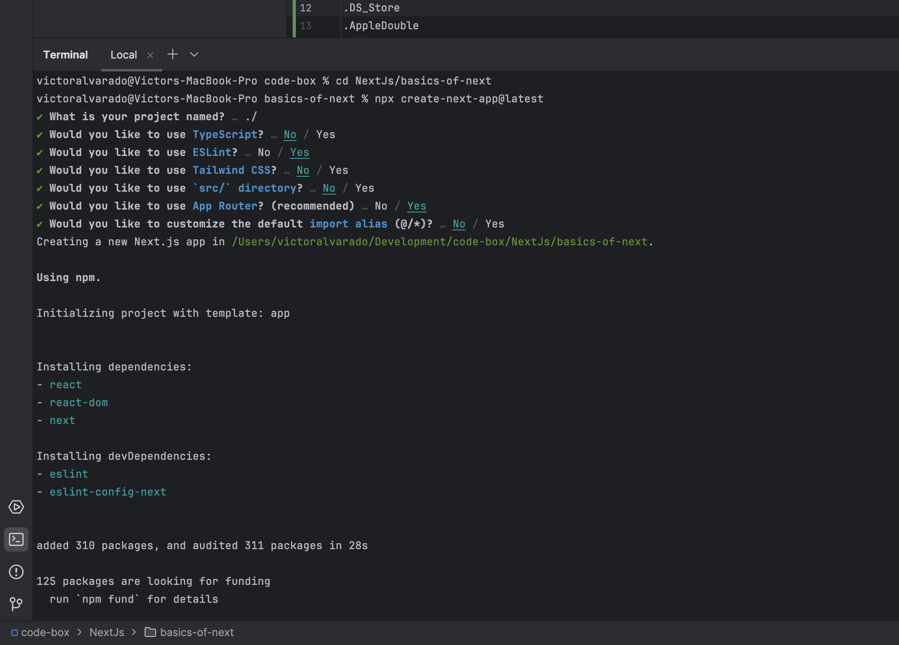

This is a [Next.js](https://nextjs.org/) project bootstrapped
with [`create-next-app`](https://github.com/vercel/next.js/tree/canary/packages/create-next-app).

## Description

This project is a simple Next.js project that I created to learn the basics of Next.js.
The topics covered in this project are:

- [Introduction to Next.js](#introduction-to-nextjs)
- [Requirements](#requirements)
- [Creating a Next.js App](#creating-a-nextjs-app)
- [App Router](#app-router)
- [Link Component](#link-component)
- [Layout Component](#layout-component)
- [Metadata Component](#metadata-component)
- [Fonts](#fonts)
- [Not Found Page](#not-found-page)
- [React Server Components](#react-server-components)
- [Image Component](#image-component)

## Introduction to Next.js

Next.js is a React framework that allows you to build server-rendered applications. It is a complete full-stack
framework that allows you to build web applications with React.js. It is a powerful tool that allows you to build web
applications with ease.

## Requirements

To run this project, you need to have Node.js installed on your machine. You can download Node.js from the official
website [here](https://nodejs.org/).
Also, you should know the basics of HTML, CSS, JavaScript and React.js.
And the last but not the least, you should have a code editor installed on your machine. I recommend using Visual Studio
Code. You can download Visual Studio Code from the official website [here](https://code.visualstudio.com/).

## Creating a Next.js App

To create a Next.js app, you can use the following command:

```bash 
npx npx create-next-app@latest
```

This command will create a new Next.js app in the current directory.

See the next image for the output of the command:



### Getting Started

First, run the development server:

```bash
npm run dev
# or
yarn dev
# or
pnpm dev
# or
bun dev
```

Open [http://localhost:3000](http://localhost:3000) with your browser to see the result.

## App Router

The App Router works in a new directory named app. The app directory works alongside the pages directory to allow for
incremental adoption. This allows you to opt some routes of your application into the new behavior while keeping other
routes in the pages directory for previous behavior.


To read more about App Router, you can visit the official
documentation [here](https://nextjs.org/docs/app/building-your-application/routing).

## Link Component

```<Link>``` is a React component that extends the HTML ```<a>``` element to provide prefetching and client-side
navigation between routes. It is the primary way to navigate between routes in Next.js. To read more about the Link
component, you can visit the official documentation [here](https://nextjs.org/docs/app/api-reference/components/link)

## Layout Component

A layout is UI that is shared between multiple routes. On navigation, layouts preserve state, remain interactive, and do not re-render. Layouts can also be nested.

You can define a layout by default exporting a React component from a layout.js file. The component should accept a children prop that will be populated with a child layout (if it exists) or a page during rendering.

For example, the layout will be shared with the /dashboard and /dashboard/settings pages:


To read more about the Layout component, you can visit the official documentation [here](https://nextjs.org/docs/app/building-your-application/routing/pages-and-layouts#layouts)

## Metadata Component

Next.js has a Metadata API that can be used to define your application metadata (e.g. meta and link tags inside your HTML head element) for improved SEO and web shareability.

There are two ways you can add metadata to your application:

Config-based Metadata: Export a static metadata object or a dynamic generateMetadata function in a layout.js or page.js file.
File-based Metadata: Add static or dynamically generated special files to route segments.
With both these options, Next.js will automatically generate the relevant <head> elements for your pages. You can also create dynamic OG images using the ImageResponse constructor.

To read more about the Metadata component, you can visit the official documentation [here](https://nextjs.org/docs/app/building-your-application/optimizing/metadata)

## Fonts

## Not Found Page

## React Server Components

## Image Component